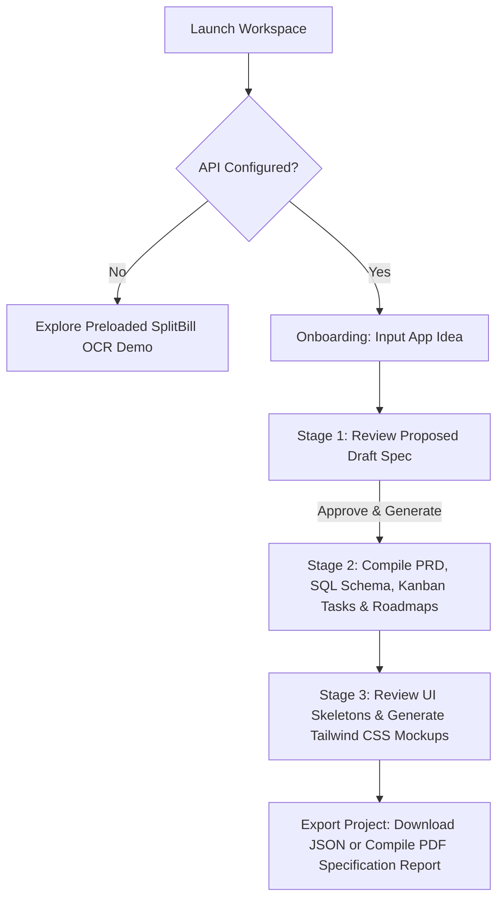

# Blueprint AI: Intelligent System Architect & App Planner

Blueprint AI is a high-fidelity, interactive React workspace designed to transform raw product ideas into comprehensive engineering blueprints. Acting as an automated lead architect, it constructs detailed specifications, database structures, project roadmaps, and even functional user interface mockups on demand. Easily integrate your preferred AI engine by passing a **MiniMax API Key** (e.g., using `Minimax-M3`) or standard OpenAI model credentials directly within the app settings.

---

## 🎨 Key Features & Interactive Sections

### 1. Abstract Concept Drafting (Stage 1)
*   **Vision Input**: Describe your application concept in detail, or start instantly using curated, industry-relevant templates (e.g., *Habit Streak Ledger*, *Travel Itinerary Builder*, *Invoice Manager*).
*   **AI Proposal Spec**: Formulates the initial app name, abstract explanation, primary feature set, and optimized technology stack.

### 2. Comprehensive Blueprint Generation (Stage 2)
*   **Product Requirement Document (PRD)**: Generates a meticulous, structured Markdown document covering objective, target audience, detailed scope, and edge cases. Includes an in-app markdown editor to refine the AI's suggestions.
*   **Relational SQL Schema**: Formulates standard SQL `CREATE TABLE` definitions including primary/foreign keys, relational constraints, indices, and field comments ready for PostgreSQL, SQLite, or Drizzle.
*   **Strategic Phasing Roadmap**: Structures sequential milestones (Phase 1 to Phase 4) represented through a dynamic, glassmorphic **Gantt Chart** (powered by Recharts).
*   **Interactive Kanban Task Catalog**: Manage, cycle, prioritize, or delete generated tasks. A built-in *Task Completion Engine* dynamically computes project completion percentages.
*   **UI Wireframe Skeletons**: Maps out structural page wireframes, detailing grid layouts, flex alignments, and individual sub-components.

### 3. High-Fidelity Tailwind CSS Mockups (Stage 3)
*   **On-Demand HTML Sandboxing**: Generate premium, static HTML code directly from a wireframe skeleton.
*   **Interactive Live Previews**: Renders the generated mockups in a sandbox frame with full Tailwind CSS support, glassmorphic styling, soft-edged buttons, mock charts, and realistic data.

### 4. Enterprise-Grade Exports
*   **PDF Spec Exporter**: Compiles a professional, multi-page, formatted PDF report containing the abstract, PRD, and strategic roadmaps.
*   **JSON Project Bundle**: Downloads the complete structured project JSON, allowing you to back up and restore your architectural state.

---

## 🛠️ Technology Stack

*   **Framework**: [React 19](https://react.dev/) + [Vite 6](https://vite.dev/) + [TypeScript](https://www.typescriptlang.org/)
*   **Styling**: [Tailwind CSS v4](https://tailwindcss.com/) (using `@tailwindcss/vite` plugin)
*   **AI Orchestration**: [@google/genai](https://www.npmjs.com/package/@google/genai) and [OpenAI SDK v6](https://www.npmjs.com/package/openai)
*   **Data Visualization**: [Recharts v3](https://recharts.org/) (Timeline bars & Gantt progression)
*   **Export Engines**: [jsPDF v4](https://github.com/parallax/jsPDF)
*   **Icons**: [Lucide React](https://lucide.dev/)

---

## ⚙️ Installation & Local Setup

### Prerequisites
Make sure you have [Node.js](https://nodejs.org/) (v18+) and `npm` installed.

### Steps
1.  **Clone the Repository**:
    ```bash
    git clone <repository-url>
    cd ai-app-planner-&-architect
    ```

2.  **Install Dependencies**:
    ```bash
    npm install
    ```

3.  **Start the Local Development Server**:
    ```bash
    npm run dev
    ```
    The application will launch on `http://localhost:3000`.

4.  **Production Build**:
    To compile the optimized production bundle:
    ```bash
    npm run build
    npm run preview
    ```

## 🔌 API & LLM Configuration

Blueprint AI is designed to run entirely on the client side, storing your projects and keys safely in your browser's local storage.

### 🌟 Easy AI Integration (OpenAI & MiniMax)
You can easily integrate your preferred AI provider:
*   **MiniMax API**: Pass your **MiniMax API Key**, set the Base URL (defaults to `https://api.minimax.io/v1/text/chatcompletion_v2`), and select/enter your model (e.g., `Minimax-M3`).
*   **OpenAI API**: Pass your **OpenAI API Key**, set the Base URL to `https://api.openai.com/v1`, and select/enter your model (e.g., `gpt-4o-mini`).

### ⚙️ How to configure:
1.  Click the **Settings** ⚙️ button in the top header.
2.  Input your **API Key** for your selected service.
3.  Verify the **Base URL** and select/enter the desired **Model**.
4.  If keys are not configured, you can still immediately explore the app's features using the preloaded **SplitBill OCR** interactive demo project.

---

## 📁 Repository Structure

```text
├── src/
│   ├── components/            # View components & interactive panels
│   │   ├── DbSchemaSection.tsx       # SQL Schema viewer & editor
│   │   ├── Onboarding.tsx           # App landing page and template seeds
│   │   ├── PrdSection.tsx            # PRD editor and markdown engine
│   │   ├── ProjectDraftSpec.tsx      # First-stage proposal approval board
│   │   ├── SettingsModal.tsx         # API Key & Model parameters configurator
│   │   ├── UiDesignsSection.tsx      # Tailwind sandbox previews & rendering
│   │   ├── UiSkeletonsSection.tsx    # Wireframe wire maps generator
│   │   └── WorkspaceDashboard.tsx    # Kanban, Gantt charts & task controls
│   ├── lib/                   # API clients and browser storage
│   │   ├── openai.ts                 # AI Prompt generation adapters
│   │   └── storage.ts                # LocalStorage handlers & preloaded seeds
│   ├── types.ts               # Shared TypeScript schemas & interfaces
│   ├── App.tsx                # App state hub, styling coordinator, and layout
│   ├── main.tsx               # DOM entrypoint
│   └── index.css              # Global styles & glassmorphic system base
├── package.json               # Dependencies and runner scripts
├── vite.config.ts             # Vite bundler, React, and Tailwind setup
└── tsconfig.json              # TypeScript compilation specifications
```

---

## 🔮 Usage Workflow


